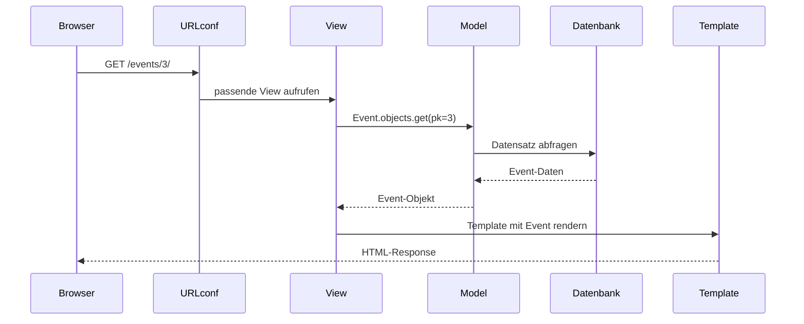

copy paste nach:

https://mermaid.live

```mermaid
sequenceDiagram
    participant B as Browser
    participant U as URLconf
    participant V as View
    participant M as Model
    participant DB as Datenbank
    participant T as Template

    B->>U: GET /events/3/
    U->>V: passende View aufrufen
    V->>M: Event.objects.get(pk=3)
    M->>DB: Datensatz abfragen
    DB-->>M: Event-Daten
    M-->>V: Event-Objekt
    V->>T: Template mit Event rendern
    T-->>B: HTML-Response
```